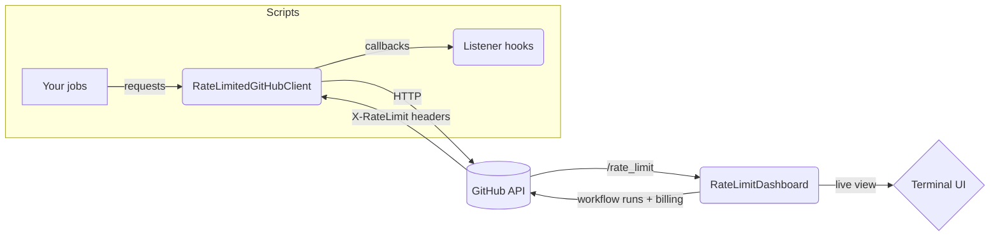

# GRatekeeper

<<<<<<< HEAD
Gratekeeper is a lightweight observability and throttling layer for GitHub.
Think of it as “one terminal pane” that gives you:

1. Real-time visibility into every rate-limit bucket across your account, plus
   GitHub Actions activity and billing minutes.
2. An optional REST client wrapper that slows your scripts down **before** you
   smack into the rate ceiling, so you can fire off aggressive workflows without
   retry storms or secondary-limit penalties.

The dashboard stays live when you are busy and gracefully falls back to periodic
polling when things calm down, so you always know what shape your quota is in.



## Highlights

- **Always-on observability:** `gratekeeper-dashboard` keeps every quota bucket,
  workflow run queue, and billing minute in one table with keyboard shortcuts
  for faster/slower redraws and an optional tmux split.
- **Opt-in throttling:** `RateLimitedGitHubClient` wraps `requests.Session`,
  automatically loads `GITHUB_TOKEN`, and exposes both raw responses and JSON
  helpers. Drop it into scripts you want to protect; keep using plain `requests`
  everywhere else.
- **Soft-floor rate keeping:** `LocalRateKeeper` watches the latest
  `X-RateLimit-*` headers, applies a configurable soft floor, and sleeps before
  you burn through a bucket, even when other apps share the same token.
- **Background refresh + listeners:** the client can poll `GET /rate_limit` when
  idle, and external listeners get a callback whenever fresh headers arrive.
- **Rich logging:** color-coded log lines highlight successful calls, 4xx/5xx
  responses, proactive sleeps, and true rate-limit hits.
=======
GRatekeeper (“GitHub Ratekeeper”) is a lightweight companion for monitoring and controlling GitHub API usage. It gives you:
>>>>>>> bucket-selection

- A lean, configurable dashboard (`gk-dash` / `gratekeeper-dashboard`) that shows every quota bucket, Actions activity, and billing minutes, with quick toggles and themes.
- A drop-in `requests.Session` wrapper (`RateLimitedGitHubClient`) that enforces a soft floor before you hit zero, plus optional killswitches for runaway jobs.

Why it’s different from simple retries/backoff:

- **Adaptive throttling before zero:** While other libraries offer automatic retries and backoff, Gratekeeper slows down your requests _before_ you hit the limit, making it safe to aggressively script your application's API calls without worrying about crossing over into the dreaded _secondary rate limit_, possibly encurring penalties or prolonged cooldown periods.
- **Multi-process friendly:** The dashboard/socket lets multiple scripts share live bucket state so one noisy job doesn’t blind the others.
- **Last-resort brakes:** A killswitch can stop all new requests during incidents, avoiding secondary rate limits.

## Quick start

Install (Python 3.10+):

```bash
pip install gratekeeper
```

<<<<<<< HEAD
- Requires Python 3.10+ and installs the `gratekeeper-dashboard` entrypoint.
- Dependencies: `requests` for HTTP and `rich` for the terminal UI/logging.

For local development (tests, typing, linters):

```bash
pip install -e .[dev]
pytest
```

`pip install -e .[dev]` pulls in `pytest` and type stubs; run `python -m unittest`
if you prefer the built-in test discovery.

## Usage

### Quick start
=======
Use the client:
>>>>>>> bucket-selection

```python
from gratekeeper import RateLimitedGitHubClient

client = RateLimitedGitHubClient()  # picks up $GITHUB_TOKEN
me = client.get_json("/user")
print(me["login"])
```

<<<<<<< HEAD
### Customize requests

```python
client = RateLimitedGitHubClient(
    token="ghp_example",                  # or rely on $GITHUB_TOKEN
    base_url="https://github.myco.com/api/v3/",
    user_agent="my-script/1.0",
    timeout=30.0,
)
client.get("/orgs/my-org/repos", params={"per_page": "100"})
```

- Set `enable_ratekeeping=False` if you need a raw client temporarily.
- Pass a custom `requests.Session` or `LocalRateKeeper` if you already manage
  those objects.
- `bucket="search"` or any other label lets the rate keeper track independent
  quotas while sharing a single client.
- GraphQL support is on deck. GitHub exposes rate-limit feedback in the
  response headers for GraphQL just like REST, so the rate keeper already has
  the data it needs. Once POST helpers land you will be able to call the GraphQL
  endpoint without any extra throttling configuration.
- The current helper issues `GET` requests only. That matches the original
  “read-mostly” use case, but the throttling logic itself is transport-agnostic;
  once POST/GraphQL helpers are added they will share the same safeguards.

### Rate-limit design

`LocalRateKeeper` is intentionally simple:

1. Every bucket caches `limit`, `remaining`, and `reset_ts`.
2. Before each request it clears expired windows, computes a soft floor
   (`limit * 0.2`, minimum 10 requests by default), and sleeps until the reset
   time plus a safety buffer whenever `remaining` dips below that floor.
3. Otherwise it decrements the local counter and lets the call proceed.

This keeps scripts responsive while avoiding accidental 403s even when the token
is shared with other tooling.

### Observability and listeners

Use snapshots for simple logging or monitoring:

```python
state = client.rate_limit_snapshot("core")
print(state.limit, state.remaining, state.reset_ts)
```

For richer integrations register listeners that receive updates whenever headers
change:

```python
def handle_update(bucket, state):
    print(f"{bucket} remaining: {state.remaining}")

client.add_rate_limit_listener(handle_update)
# ... later
client.remove_rate_limit_listener(handle_update)
```

### Background polling

Stay in sync when other apps consume API quota:

```python
client.start_rate_limit_polling(interval_seconds=90, bucket="core")
# ...
client.stop_rate_limit_polling()
```

The poller reuses the same client, calls `GET /rate_limit`, and automatically
backs off whenever normal requests provide fresh headers.

## Realtime dashboard

`gratekeeper-dashboard` is a Rich TUI that watches `GET /rate_limit`, displays
each bucket, and optionally tracks GitHub Actions activity.

```bash
# basic view
gratekeeper-dashboard --refresh 10 --fetch 60

# include GitHub Actions data
gratekeeper-dashboard --actions my-org/service another/repo \
  --actions-billing-user --actions-billing-org my-org
```

- Provide `--token` or rely on `GITHUB_TOKEN`. `--base-url` works with GHES.
- `--buckets core search` limits the table to specific quotas.
- Actions integration shows in-progress/queued workflow runs per repo plus
  billing minutes for the authenticated user or an organization.
- Keybindings: `u` speeds up redraws, `d` slows them down, `r` triggers an
  immediate fetch, `Ctrl+C` exits.
- `--fetch` controls how often the dashboard polls when the client has been
  idle; real API calls instantly update the table through rate-limit listeners.
- `--tmux-pane` attempts to spawn the dashboard in a 40% vertical split when
  running inside tmux. Outside tmux it quietly falls back to normal behavior.

Embedding the dashboard inside an existing script is just a matter of creating a
`RateLimitDashboard` with your existing `RateLimitedGitHubClient`. The dashboard
subscribes to the client’s listener API, so every request immediately refreshes
the table, and idle periods fall back to an occasional `GET /rate_limit`.

VHS-powered demos and a richer visual walkthrough are on the way to showcase the
TUI experience without cloning the repo first.

## Logging

Importing Gratekeeper attaches a Rich `RichHandler` to the `gratekeeper` logger
(unless you already configured handlers). Successful requests log in green,
standard 4xx errors in yellow, and rate-limit hits or forced sleeps in bold red
or yellow so you can see issues at a glance. Configure your own logger before
importing Gratekeeper if you want different styling.
=======
Run the dashboard:

```bash
gk-dash --refresh 10 --fetch 30 --actions my-org/my-repo
# prefer a simpler table? add --ui table
```

Common tasks:

- Customize HTTP: pass `token`, `base_url`, `user_agent`, or `bucket="search"` to isolate quotas.
- Disable throttling temporarily: `enable_ratekeeping=False` on the client.
- Themes/presets/bucket toggles/Actions on/off are built into the Textual UI; see the dashboard guide below.

## Security and compatibility
>>>>>>> bucket-selection

- The socket bridge is local-only but unauthenticated; change the path or disable with `--socket none` / `GRATEKEEPER_SOCKET=none` on shared hosts. On Windows, the bridge is disabled automatically.
- Works with REST and GraphQL; buckets stay separate unless you intentionally merge them via `bucket=...`.

<<<<<<< HEAD
```bash
pip install -e .[dev]
pytest
# or
python -m unittest discover -s tests -t .
```

The repository keeps tests, typing, and lint helpers under the `dev` extra so
the published wheel stays lean.
=======
## Where to go next

- Rate-limit math, soft floor, killswitch details: [EXPLAINER.md](EXPLAINER.md)
- Advanced client features (polling, listeners, socket bridge, logging, dev/demos): [ADVANCED_USAGE.md](ADVANCED_USAGE.md)
- Dashboard controls (themes, Active-only/manual presets, digit toggles, Hide Actions): [docs/dashboard-bucket-visibility.md](docs/dashboard-bucket-visibility.md)
- Local dev, tests, demos: [CONTRIBUTING.md](CONTRIBUTING.md) and `scripts/run_demo_scenarios.py`
>>>>>>> bucket-selection
